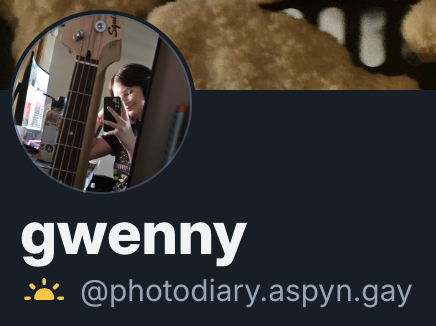

# photodiary experiment
### 01/21/25
### Words: ??
self improvement with a fun experiment

## premise
"I used to think photo diaries and memory journals were trivial mnemonics until I realized how fragile our memories are" -Vylet Pony

i want to find out just how possible it is to stay private on bluesky, and i want to start documenting my life. why not do both? i think it's interesting the way that when people make "private accounts" or "alts" on bluesky, they very quickly go from a small group of trusted people to being widespread in a matter of days due to algorithmic feed generation. namely the "popular with friends" feed, one which aims to show you the posts that your mutuals are engaging with. this is cool for expanding your circle, but also terrible if that goes against your goal. i've been wanting to start a photodiary ever since watching an unhealthy amount of Vylet Pony's [Antonymph MV](https://www.youtube.com/watch?v=CNPdO5TZ1DQ) over my winter break this year, and what better way to do that than an account i can dump photos and videos on to document my memories in case someday i forget them?

### execution
### 00 - a new beginning
on january 21st 2025, for the first time since creating [my bsky account](https://bsky.app/profile/aspyn.gay) back in june of 2023, i was going to have a fresh start on the website. i've been on a [relatively new account](https://bsky.app/profile/charlotte.partners) before but i hadn't actually been at the start myself. after a little fighting with cloudflare to figure out my custom handle, the photodiary was born. 

### 01 - the plan
now, what do i do from here. obviously there's not much of a reason to be using a social media for my diary if i don't want other people to see it, but what's the fun in just showing people?

for the first leg, i plan on just posting on this account with no artificial audience injection. i'm not telling anyone the handle and not following anyone on the account, not even myself, nor following the account. if all goes as expected nobody will find me, maybe a random bot or somehow someone getting recommended, but i doubt anyone in my circle will manage to find it. after a few weeks if it hasn't picked up, i'll give it a little boost by giving it an interaction. i'll give [my best friend](https://bsky.app/profile/wamwoowam.co.uk) the account and ask them to follow it, and see how quickly it picks up from there. i'm excitedly awaiting what observations can come from this, and also just hoping i get better at documenting my life.

### 02 - the plan sucks im getting a new plan
1/26/25 - im getting impatient but the observable features of this experiment seem apparent from the five days i have been waiting. i have made 8 posts in this time, and i have not received a single interaction. it appears that the algorithms to show things to people do require a baseline level of engagement in order to find a circle to feed your posts to.

now, what intrigues me is where this baseline of engagement is. i have seen from friends making alt accounts that even with just a few people following and interacting with the account, it will be recommended and spread like wildfire. i'm making a slight amendment to my plan, and going to try to work this out in small steps:

1. follow someone on the account but do not otherwise interact
2. interact with posts but not receive any reciprocation
3. follow the account but do not otherwise interact
4. add interactions (likes)

### 03 - end phase 1
2/3/25 - still no interactions, which is to be expected. i doubt there will be any change in traffic to the photodiary account until at least phase 3 of the experiment. i will now be moving on to phase 2, which will involve liking posts as the photodiary account. i expect no change but i will observe nonetheless

### 04 - end phase 2
2/7/25 - still no interactions, as expected. the next step (following the photodiary on other accounts) is where it plausibly could start having some traffic. up to now though, the only way someone could find it is by stalking followers/likes on posts. im excited to see where this goes!

### 05 - end phase 3
2/12/25 - still no interactions. somewhat unsurprising, but still worth noting that this means that the (only?) way a post/account will be thrown into circles is if it's actively being interacted with, not just being followed. at this point someone could have easily found this account by follow stalking one of the planted accounts but the realistic likelihood of that happening is low

comment on the fact that i could have probably found the source code for this but that doing it observationally is fun
comment on how "pseudo-private accounts" could best be achieved currently by having "trusted members" agree to not like/interact with posts